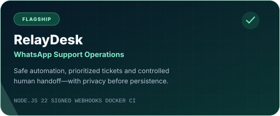
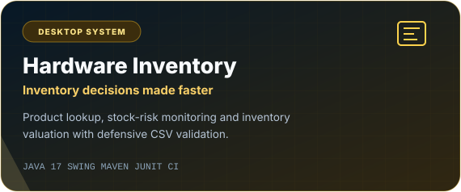
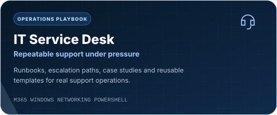
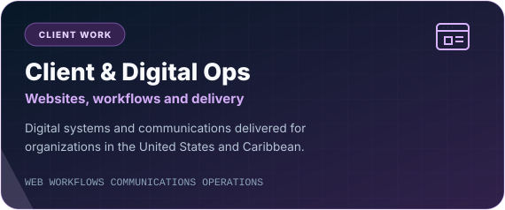

  

  
  
  

  I bridge the gap between <strong>people, operations and technology</strong>—supporting users calmly,
  documenting what works and building practical systems that remove friction.

## What I bring

<table>
  <tr>
    <td width="33%" valign="top">
      <h3>🛠️ Support</h3>
      
Troubleshooting, user guidance, escalation and documentation that keep people productive.

    </td>
    <td width="33%" valign="top">
      <h3>⚙️ Operations</h3>
      
Clear workflows, reliable handoffs and measurable improvements built around real work.

    </td>
    <td width="33%" valign="top">
      <h3>💻 Engineering</h3>
      
Practical Java, JavaScript and automation projects with tests, CI and security thinking.

    </td>
  </tr>
</table>

## Impact at a glance

<table>
  <tr>
    <td width="33%" align="center"><strong>400</strong> students supported</td>
    <td width="33%" align="center"><strong>40–45</strong> daily support interactions</td>
    <td width="33%" align="center"><strong>≈60%</strong> paperless workflow achieved</td>
  </tr>
</table>

## Featured work

<table>
  <tr>
    <td width="50%" valign="top">
      
    </td>
    <td width="50%" valign="top">
      
    </td>
  </tr>
  <tr>
    <td width="50%" valign="top">
      
    </td>
    <td width="50%" valign="top">
      
    </td>
  </tr>
</table>

### RelayDesk — flagship case study

RelayDesk demonstrates how I approach production-minded support tooling: authenticated webhook intake, deterministic knowledge responses, sensitive-data redaction, prioritized ticketing, explicit human ownership and measurable service operations.

[Explore the repository →](https://github.com/ramphalharrilal/whatsapp-support-operations)

## Software & platforms

  

Tools I use to deliver support, websites, QA, automation and software—not a list of everything I have ever opened.

**Support & administration**

**Collaboration & client delivery**

**Quality & infrastructure**

## How I work

- **Start with the user:** understand the impact before reaching for a technical fix.
- **Make work repeatable:** turn one successful resolution into a runbook, template or automation.
- **Protect trust:** minimize sensitive data, validate inputs and make ownership explicit.
- **Finish professionally:** test the result, document the decision and leave the next person a clear path.

## Current direction

I am completing a **Bachelor of Science in Computer Science** while deepening my capability across IT support, automation, software quality and cybersecurity. I am interested in remote roles where calm customer support, technical problem-solving and process improvement matter equally.

  <strong>Have a support, website or operations problem that needs a practical solution?</strong>  
  <a href="mailto:harrilal20@gmail.com">Email me</a>
  &nbsp;•&nbsp;
  <a href="https://ramphalharrilal.github.io/">View my portfolio</a>
  &nbsp;•&nbsp;
  <a href="https://www.upwork.com/freelancers/~0123e265f21c212396">Hire me on Upwork</a>

  
<strong>Earlier learning repositories</strong>

   
  <ul>
    <li><a href="https://github.com/ramphalharrilal/java-projects">Java application archive</a></li>
    <li><a href="https://github.com/ramphalharrilal/python-projects">Python fundamentals archive</a></li>
  </ul>
  
These repositories preserve earlier coursework. The featured systems above represent the standard and direction of my current portfolio.

